# HifzAI — Product Documentation (Phases 1–28)

---

## 1. Verification Scope

This document is based on a **static review of the project's source code** — models, services, routers, migrations, tests, and the project's own README — not on running the application. Everything described here corresponds to code directly read during this review, unless explicitly marked as a future/roadmap item.

**What this does NOT cover:** runtime behavior (whether the UI actually renders as the code implies, whether a live request actually behaves as its handler suggests in every case), deployment-specific behavior in a real production environment, and the live behavior of external integrations (Al Quran Cloud API, OpenAI Whisper/Chat Completions, Web Push, SMTP). None of that was executed in this review — it would need real deployment and testing to confirm, not a source read. The one exception: Python syntax was mechanically compiled to catch basic errors; no test suite was actually run (no network access to install dependencies in this review environment).

---

## 2. Product Overview

HifzAI is an AI-assisted Quran memorization (Hifz) platform built for Islamic education institutes — Quran schools, hifz academies, and mosques. It connects four kinds of users — students, teachers, parents, and institute administrators — inside a single multi-tenant SaaS product, rather than four disconnected tools.

**The problem it solves.** Traditional hifz tracking is largely manual: paper registers, a teacher's memory of who's weak on which page, WhatsApp updates to parents, ad-hoc test schedules. HifzAI replaces that with a structured Learn → Practice → Test workflow, a real spaced-repetition revision engine (SM-2, not a guess), teacher- and admin-visible analytics down to a specific weak page or ayah, and institute-level oversight — all built on a stated principle carried through every phase of its own build log: never present an invented or approximate number as if it were measured fact.

**Who uses it:**
- **Students** — memorize, revise, and get tested inside the app, with real progress and gamification tracked over time.
- **Teachers** — assign lessons, review recitation history, run live classes, message their students/parents, and issue certificates.
- **Parents** — follow a linked child's real progress, get notified of events, and message the teacher.
- **Institute admins** — manage the organization itself: teachers, classes, students, branding, marketplace add-ons, and (as of Phase 28) external system integrations via a public API.

**Why it's different.** Two threads run through all 28 phases:
1. **Honesty about what's real vs. approximate.** Every phase's own documentation states plainly when a metric is a measured fact, a documented heuristic (like the SM-2 schedule), or an explicit proxy (like "memorized ayat" meaning "self-marked correct in a test," not independently verified) — rather than presenting all numbers with equal, false confidence.
2. **Quran content is never hand-typed.** Ayah text, audio, and positional data (pages, juz, hizb) are fetched live from verified sources at runtime, never bundled as static data that could silently drift from a transcription error.

---

## 3. Glossary

| Term | Meaning |
|---|---|
| **Hifz** | The act of memorizing the Quran |
| **Hafiz** (fem. *Hafiza*) | A person who has memorized the entire Quran |
| **Sabaq** | The new lesson/portion a student is currently memorizing |
| **Sabqi** | Recently-memorized material, still fragile, revised frequently |
| **Manzil** | Older, long-memorized material revised on a longer rotating cycle so it doesn't fade |
| **Juz** | One of 30 roughly-equal parts the Quran is divided into — the most common unit for tracking memorization progress |
| **Hizb** | A subdivision of a juz (each juz has 2 hizb) |
| **Ayah** | A single verse of the Quran |
| **Surah** | A chapter of the Quran (114 total) |
| **Mushaf** | A physical or digital copy of the Quran's written text |
| **Uthmani script** | The standardized Quranic text form used in virtually all printed/digital Qurans today |
| **Tajweed** | The rules governing correct Quranic pronunciation and articulation |
| **Waqf** | A designated pause/stopping mark in the Quranic text |
| **Sajdah** | A verse that calls for a physical prostration upon recitation |
| **Qari / Reciter** | Someone who recites the Quran — in this app, specifically the reference audio reciter (e.g. Al-Husary) a student learns from |
| **Halaqah** | A small study circle — used loosely to describe a typical live Quran class size (5–20 students) |

---

## 4. Roles at a Glance

| Role | Core capabilities |
|---|---|
| **Student** | Learn Mode, Practice Mode, Test Mode (12 modes), Progress & advanced analytics, Revision queue, Leaderboard, Visual Memorization, AI Assistant, Notes, join Live Classes, Certificates, Messages, Notifications |
| **Teacher** | Class roster, assign Sabaq, give feedback, review practice/test history, host Live Classes, issue attendance/competition certificates, post class announcements/homework, message students/parents |
| **Parent** | View a linked child's real progress, receive notifications (event-driven + weekly digest), message the teacher (reply-only — see §6), view class announcements/homework |
| **Admin** | Manage teachers/classes/students, institution analytics, audit log, organization branding, Marketplace, Developer API keys |

---

## 5. Feature Matrix

Generated from the actual role guards in the code (`RequireRole` on the frontend, `require_role`/route-level dependencies on the backend — see §11, Security) — not an idealized permission model. ✅ = full access, **View** = read-only, **—** = no access/no feature exists for that role.

| Module | Student | Teacher | Parent | Admin |
|---|---|---|---|---|
| Learn Mode | ✅ | — | — | — |
| Practice Mode | ✅ | — | — | — |
| Test Mode (12 modes) | ✅ | — | — | — |
| Visual Memorization | ✅ | — | — | — |
| AI Assistant (chat) | ✅ | — | — | — |
| Notes | ✅ | — | — | — |
| Leaderboard / Gamification | ✅ | — | — | — |
| Revision queue (Sabqi/Manzil) | ✅ | — | — | — |
| Progress & Advanced Analytics | ✅ (own) | View (own students, via roster) | View (linked child) | View (aggregate/institution-level only — no per-student drill-down page) |
| Assign Sabaq | — | ✅ | — | — |
| Give Feedback | — | ✅ | — | — |
| Live Classes | Join | Host | — | — |
| Certificates | View (own) | Issue (attendance/competition) | — | Branding only (via org settings — no direct cert management screen) |
| Messaging | Reply/participate | Initiate + participate | Reply only (can't start a new conversation — see §6) | — (not part of the messaging permission model at all) |
| Announcements | View (own class + institution-wide) | Post (own class) | View (child's class + institution-wide) | Post (institution-wide only) |
| Homework | View (own class) | Post (own class) | View (child's class) | — |
| Class management (create/assign) | — | — | — | ✅ |
| Organization management (branding, plan) | — | — | — | ✅ |
| Audit log | — | — | — | ✅ |
| Marketplace | — | — | — | ✅ |
| Developer API (keys) | — | — | — | ✅ |

---

## 6. User Journeys

### Student Journey
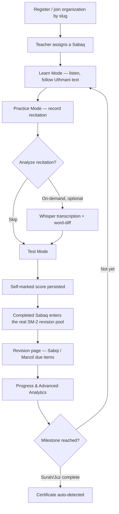
Note: AI recitation analysis is opt-in per attempt, not automatic (it calls a paid external API) — a student can go straight from Practice to Test without it.

### Teacher Journey
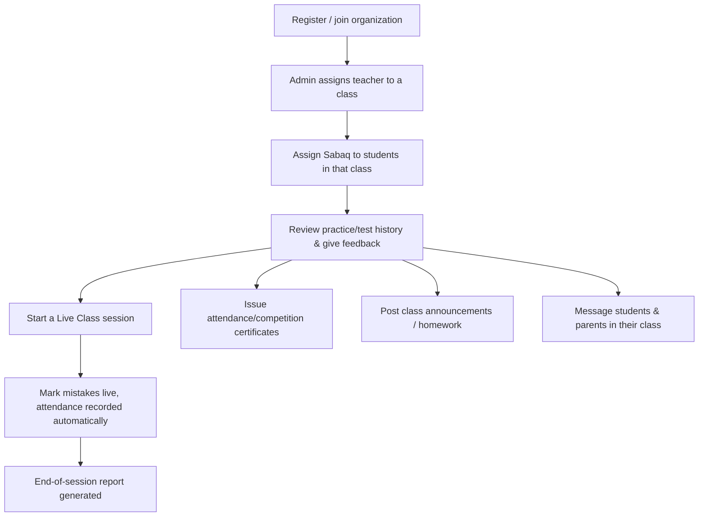
Note: a teacher doesn't "invite" students directly — an **admin** creates classes and assigns students to them; the teacher then works with whoever administration has placed in their class.

### Parent Journey
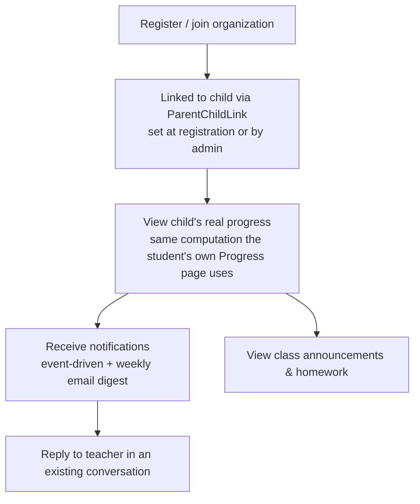
Note: a parent can **reply** once a conversation exists, but currently can't start a new one first — only the teacher's side can initiate a conversation (a stated, narrow next increment, not a broken access-control model).

### Admin Journey
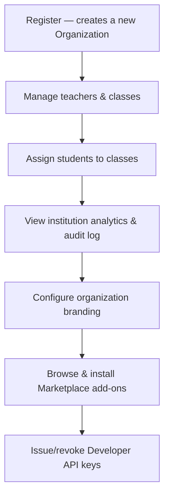

---

## 7. Sequence Diagrams

Technical detail behind §6's journeys — each one traces an actual code path, not a hypothetical design.

### Learn Mode
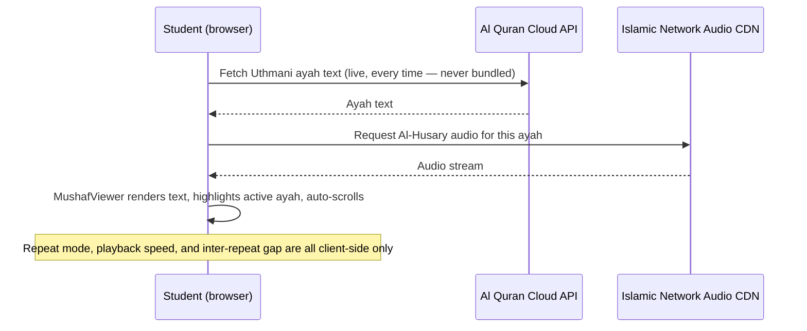

### Practice Mode
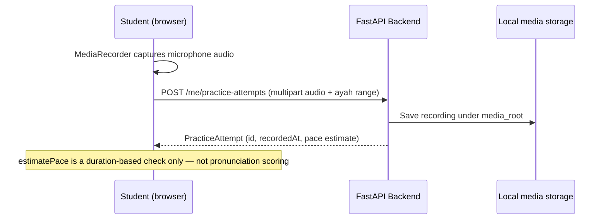

### Test Mode
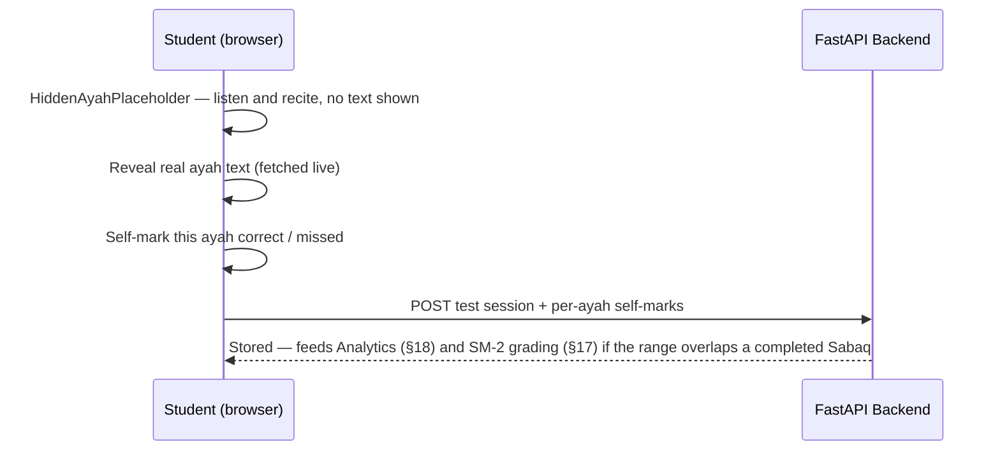

### AI Analysis (Recitation, Phase 14)
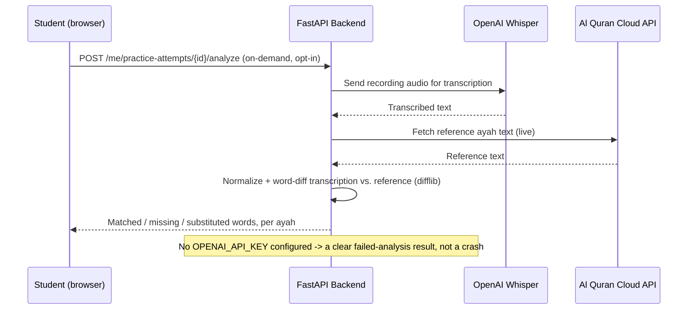

### Offline Sync
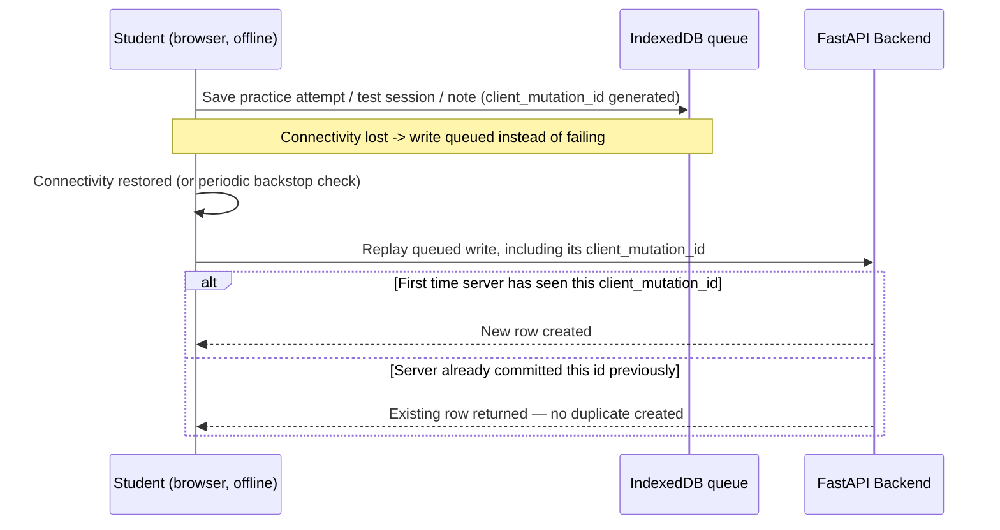

### Live Classes
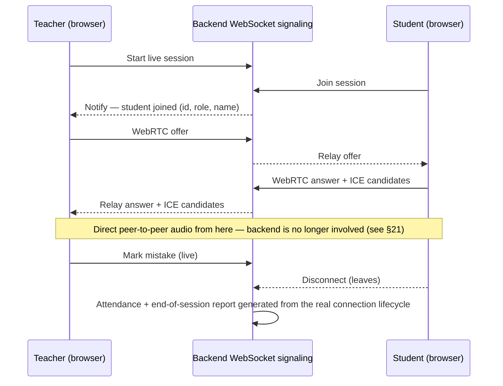

### Teacher Assigning a Sabaq
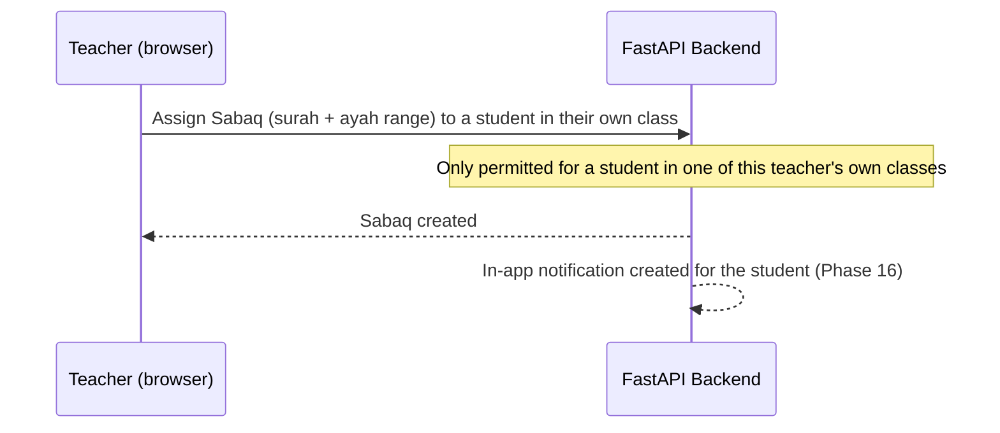

---

## 8. Architecture Overview

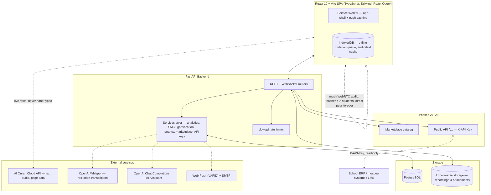

Key point: once a Live Class's WebRTC connection is established, **recitation audio flows directly between browsers** — it never passes through the backend. The backend only relays the initial signaling handshake (offers/answers/ICE candidates).

---

## 9. Data Model Diagram

An entity-relationship view of §10's table, built from the actual foreign keys in the reviewed model files. Simplified for readability — a few narrower relationships (e.g. exactly which event triggers a given `Certificate` row) are described in prose in §10 and §17 rather than drawn here.

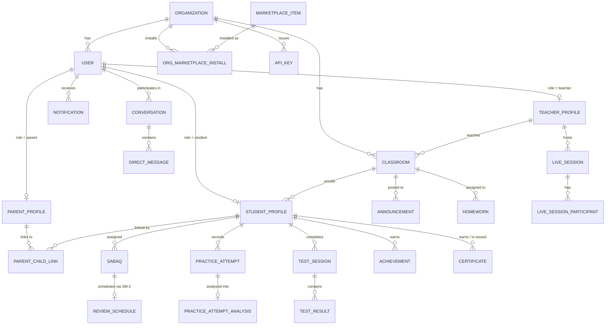

---

## 10. Core Database Models

| Model | Purpose |
|---|---|
| `Organization` | The tenant boundary — plan limits, branding |
| `User` | One row per login; `role` = student / teacher / parent / admin |
| `StudentProfile` / `TeacherProfile` / `ParentProfile` | Role-specific data (streak, class membership, etc.) |
| `ClassRoom` | A teacher's class within an organization |
| `ParentChildLink` | Real parent ↔ student linking |
| `Sabaq` | An assigned memorization lesson (surah + ayah range) |
| `PracticeAttempt` / `PracticeAttemptAnalysis` / `PracticeMistakeRow` | Recorded recitation attempts and their Whisper-based word-diff analysis |
| `TestSession` / `TestResult` | A Test Mode session and its per-ayah self-marked results |
| `ReviewSchedule` | The real SM-2 spaced-repetition state, one row per Sabaq |
| `Achievement` | Earned gamification achievements |
| `Notification` / `PushSubscription` | In-app and web-push notification records |
| `AuditLogEntry` / `PasswordResetToken` / `RefreshToken` | The security/auth trail |
| `ChatConversation` / `ChatMessage` | The AI Assistant's persisted conversation |
| `Note` | Student notes (offline-queueable) |
| `LiveSession` / `LiveSessionParticipant` / `LiveSessionMistake` | Live class records — attendance, mistake-marking |
| `Certificate` | Issued/auto-detected certificates |
| `Conversation` / `DirectMessage` / `Announcement` / `Homework` | Messaging, announcements, homework |
| `MarketplaceItem` / `OrganizationMarketplaceInstall` | Marketplace catalog + per-org installs |
| `ApiKey` | Public API credentials (hashed, never stored raw) |

**Relationship shape:** `Organization` → many `User` rows (one role each) → a teacher's `ClassRoom`s / a student's `class_id` membership / a parent's `ParentChildLink` rows. Most content tables (`Sabaq`, `PracticeAttempt`, `TestSession`, `ReviewSchedule`, etc.) deliberately do **not** carry their own `organization_id` — see §14, Multi-Tenancy.

---

## 11. Security

| Area | What's actually implemented |
|---|---|
| Authentication | JWT access tokens (15-minute expiry) + refresh tokens (30-day, rotated, single-use) |
| Token storage | Only the refresh token's SHA-256 hash is ever stored — same for API keys |
| Passwords | bcrypt hashing; reset flow never reveals whether an email is registered |
| Account lockout | 5 failed logins locks the account for 15 minutes |
| Rate limiting | `slowapi`, per-route (e.g. 10/minute on login, 60/minute on public API endpoints) |
| Audit log | Every login attempt, lockout, registration, token refresh/revocation, and password reset is a real, admin-visible row |
| Tenant isolation | Every admin-facing "list everyone" query is scoped to `organization_id`, verified by dedicated cross-tenant tests |
| API keys | SHA-256 hashed, shown once at creation, individually revocable, org-scoped |
| Recording | Requires a secure browser context (`https://` or `localhost`) — a browser restriction, not app configuration |
| Role enforcement | `RequireRole` route guards on the frontend + `require_role(...)` FastAPI dependencies on the backend — the source for §5's Feature Matrix |

**One honest gap worth flagging:** the `/media` static file mount (practice recordings, message attachments) has **no per-request authorization** — a file is reachable by anyone who has its URL, relying on the URL being hard to guess rather than a real access check. This has been true since Phase 10 and hasn't been closed by any later phase.

---

## 12. Data Privacy & Safeguarding

HifzAI handles children's names, voice recordings, progress history, and parent–teacher messages across multiple institutes on shared infrastructure. This is realistically the first thing a serious institute, parent, or investor will ask about — so it deserves a direct, honest answer rather than silence, even where the honest answer is "not built yet."

| Question | Current reality |
|---|---|
| Who can access a student's recordings? | Reachable by anyone with the file's direct URL — see §11's flagged gap. In normal use it's only ever surfaced through the student/teacher/parent screens the UI exposes, but there is no server-side per-request permission check on the file itself. |
| How long are recordings kept? | Indefinitely. There is no retention window and no automatic-deletion job anywhere in the scheduler. |
| Can an institute delete a student's data? | No. There is no data-deletion or data-export endpoint for a student, a class, or an organization. |
| What happens when a student leaves? | No offboarding flow exists — no account deactivation, archival, or anonymization step. |
| Can parents request data deletion? | No request/consent flow exists for this. |
| Who owns the data — the institute or HifzAI? | Not addressed anywhere in the product. This is a legal/contractual question that needs real Terms of Service, not a code answer. |
| How is data isolated between organizations? | **This one is real.** `Organization` is a genuine tenant boundary (Phase 18), enforced on every admin-facing query and verified by automated cross-tenant tests (§24). |

**What a real institute rollout would need before onboarding actual students**, none of which exists today:
- A stated data-retention period for recordings and attachments, with automatic deletion after it
- A student/organization data export and deletion tool (for "right to be forgotten"-style requests)
- A real account-offboarding flow for students who leave an institute
- A published data-processing agreement clarifying that the institute — not HifzAI — is the data controller for its own students
- Encryption at rest for stored recordings, and closing the unauthenticated `/media` gap from §11

None of this is implemented today. It's listed here — not just in the Future Roadmap — because it's a prerequisite for handling real children's data responsibly, not a nice-to-have feature.

---

## 13. AI Features

**Real AI in this app:**
- **Whisper transcription** (Phase 14) — a practice recording is transcribed and word-diffed against the real reference ayah text.
- **Tool-calling AI Assistant** (Phase 22) — grounds its answers in three real backend tools: weak-spot analytics, the due-reviews queue, and the progress summary — rather than inventing a plausible-sounding answer.
- **General tajweed Q&A** — answered from the model's own general knowledge, with an explicit caveat that it's educational information, not a certified ruling on the student's own recitation.

**What is arithmetic, not AI (feeds the Assistant, but isn't itself AI):**
- Weak-spot analytics (weakest juz/surah/pages, most-forgotten ayah, retention rate) — pure formulas over recorded rows.
- `confidence_score` — a documented weighted blend (`0.6 × retention_rate + 0.4 × overall_accuracy`), not a trained model's output.

**Explicitly NOT built (stated directly, not implied):**
- Tajweed rule detection (elongation, ghunnah, qalqalah, articulation) — needs acoustic/phonetic modeling this app doesn't attempt.
- Pronunciation or fluency scoring — no such field exists anywhere in the data model.
- Emotional/sentiment feedback — not a feature.
- AI grading of Test Mode — scores are always self-marked by the student, never AI-graded.

---

## 14. Multi-Tenancy Model

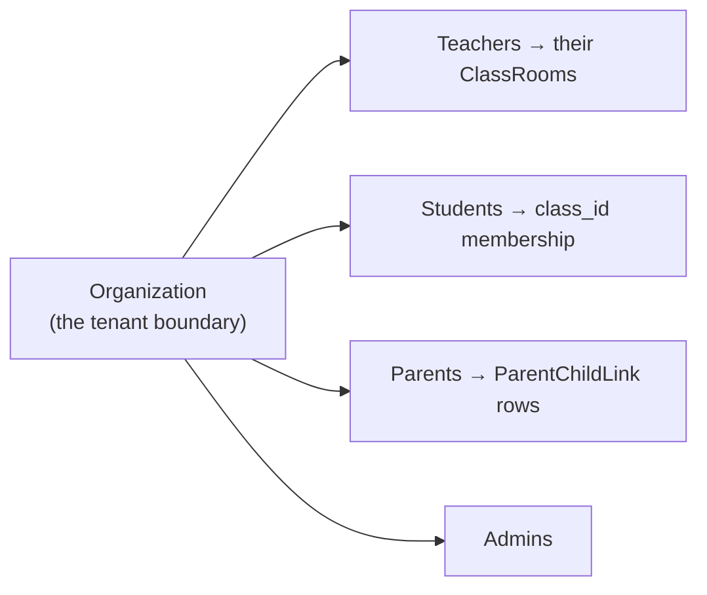

The tenant boundary lives on exactly two tables: `User` and `ClassRoom`. Content tables — `Sabaq`, `PracticeAttempt`, `TestSession`, `ReviewSchedule`, feedback, achievements, notifications — deliberately have **no** `organization_id` column of their own. Every query against them was already scoped to one specific student (via that student's own session, a teacher's class roster, or a parent's linked child), so there was no cross-tenant query to fix. The real risk was in admin-facing "list everyone"/"leaderboard" queries, which now filter by organization and are covered by dedicated isolation tests.

Plan limits (`max_students`/`max_teachers`) are enforced at registration (HTTP 402 if exceeded). **There is no real billing** — upgrading a plan today is a manual database update, not a checkout flow.

---

## 15. Offline Synchronization

**What actually happens if the connection disappears** (Phase 24), scoped to practice attempts, test sessions, and notes only — not every action in the app:

1. A write made while offline is saved to a local **IndexedDB queue** instead of failing.
2. Every queued write carries a **client-generated `client_mutation_id`**.
3. On reconnect (checked immediately, and periodically as a backstop), the queue replays against the real API.
4. If a sync is interrupted after the server already committed but before the client got the response, the retry is recognized by that same `client_mutation_id` and returns the existing row — **this is duplicate prevention, not true conflict merging.**

**Worth being precise about:** there is no conflict-resolution UI for genuinely divergent concurrent edits (e.g. the same note edited on two offline devices before either syncs) — the system guarantees a retried write is never duplicated, it does not attempt to merge two different offline edits to the same record. Quran text/pages and the last-successful Dashboard/Progress response are also cached, so they're viewable (read-only, as of the last sync) while offline.

---

## 16. File & Media Storage

- **Recordings** (Practice Mode attempts, messaging voice notes) and **message attachments** are genuinely uploaded via multipart form data and saved to local disk under a configurable `media_root`, served back through a `/media` static mount. A production deployment would want to swap this for S3/CDN — a stated limitation since Phase 10, not yet closed.
- **Certificates** are PDFs generated **on demand** with `reportlab` and are **never stored** — regenerating one always reflects the organization's current branding rather than a stale snapshot from when it was first earned.
- See §11 for the honest caveat that `/media` isn't access-controlled beyond an unguessable URL, and §12 for what real data-retention handling would still need to add.

---

## 17. Sabaq → Sabqi → Manzil → SM-2 (how the traditional workflow maps in)

This is the relationship worth being precise about, since it's central to how most institutes actually teach hifz:

- **Sabaq** is the unit this whole app organizes around: a specific memorization assignment (a surah + ayah range) a teacher gives a student. It is *not* one ayah — scheduling ~6,236 individual ayahs separately would be finer-grained but disproportionate to what any phase needed.
- Traditionally, a student's day splits into three buckets: **Sabaq** (today's new lesson), **Sabqi** (recently-memorized material, revised frequently while it's fragile), and **Manzil** (older, distant material, revised on a longer rotation so it never fully fades).
- **Phase 10** approximated this with a heuristic: "Sabqi" was simply the second-most-recently-assigned Sabaq, and "Manzil" was a guess based on how many juz behind the student's overall progress was. Both were explicitly labeled as heuristics, not real scheduling.
- **Phase 13** replaced that heuristic with a real algorithm: **every completed Sabaq immediately joins one shared SM-2 spaced-repetition schedule** (the same industry-standard algorithm behind most flashcard apps — chosen over a fancier one like FSRS specifically because SM-2 needs no training data to be correct from day one). Grading is real, too: completing a Test Mode session whose range overlaps a completed Sabaq automatically grades that Sabaq's SM-2 schedule from the student's own self-marked score — no separate grading step exists.
- **So "Sabqi" and "Manzil" today are just two labeled windows into that one real due-queue**, not separate tracked categories: Sabqi shows the most-recently-assigned Sabaq that is currently due, and Manzil shows the oldest (most overdue) due Sabaq. If nothing is actually due for either slot, it's shown genuinely empty rather than filled with something invented. The `/revision` page (also from Phase 13) lists every currently-due review, most overdue first, each linking straight into Test Mode with the range pre-filled.

In short: the traditional 3-bucket workflow isn't three separate structures in this app — it's one real spaced-repetition pool, with Sabqi and Manzil as two honestly-labeled views into the near and far ends of that same pool's due list.

---

## 18. Analytics — Where Each Number Actually Comes From

All of Phase 19's headline numbers are real arithmetic over recorded rows, gated by a **minimum-attempts threshold of 2** (so a single unlucky miss can't dominate a ranking for a new student):

| Metric | Computed from |
|---|---|
| Overall accuracy | All `TestResult` self-marks across every Test Mode session |
| Weakest surah / juz / pages | Per-bucket accuracy across `TestResult` rows, grouped by surah/juz/page (juz/page lookups fetched live, never hand-typed) |
| Most-forgotten ayah | The ayah with the highest missed-count across `TestResult` rows, at or above the attempt threshold |
| Retention rate | Derived from `ReviewSchedule` (SM-2) outcomes — how often a due review is actually recalled successfully |
| Confidence score | `0.6 × retention_rate + 0.4 × overall_accuracy` — a documented blend of two real signals, explicitly not a trained model's output |
| Average revision time | Average duration of completed Test Mode sessions tied to a Sabaq's review |
| Longest streak | `StudentProfile.longest_streak` — a real, persisted counter, never reset by a broken streak |

Nothing here is "the AI guessing" — every figure traces back to a specific recorded `TestResult` or `ReviewSchedule` row.

---

## 19. Marketplace — Frequently Asked Question

**Can an institute upload or sell its own marketplace item?**
**No.** The Marketplace (Phase 27) is a fixed, curated catalog seeded once by the backend itself (question banks, revision plans, premium reciters, themes, plugins) — there is no vendor onboarding flow, no "publish your own item" screen, and no review/approval pipeline, because none of that exists yet. An institute can only browse and install from the existing list. Installing anything — free or premium — is instant and does not charge a card, because there is still no real payment processor anywhere in the app (the same scope cut Phase 18 made for plan billing).

---

## 20. Public API — Example Request

```
GET /v1/students
X-API-Key: hfz_live_9F2kQ...redacted...

200 OK
[
  {
    "id": "stu_4f9a2b1c8d3e",
    "name": "Yusuf Rahman",
    "className": "Hifz Circle A",
    "currentStreak": 12,
    "longestStreak": 96
  },
  {
    "id": "stu_7c1e5f60a2b9",
    "name": "Amina Yusuf",
    "className": "Hifz Circle B",
    "currentStreak": 0,
    "longestStreak": 41
  }
]
```

Also available: `GET /v1/students/{id}/progress` (the same real `ProgressSummary` the student's own Progress page uses) and `GET /v1/classes`. Every response is scoped to the calling key's own organization; a revoked or invalid key gets `401 Unauthorized`. There is currently **no write endpoint** — an ERP can pull data out, but nothing pushes attendance, grades, or enrollment back into HifzAI yet.

---

## 21. Live Classes — Privacy Note

**Teacher hears students live. Audio never passes through the backend once the WebRTC connection is established** — the backend's only job is relaying the initial signaling handshake (offers, answers, ICE candidates) between browsers; after that, audio flows directly, peer-to-peer, between the teacher's and each student's browser (a mesh/"hub" topology). This is realistic for a halaqah-sized class (roughly 5–20 students) and needed no dedicated media-server infrastructure, but it will not scale to a large lecture hall without a real SFU (mediasoup/LiveKit/Janus) — a stated, separate future project, not something quietly assumed to already work at scale.

---

## 22. Deployment & Environment

**Supported deployment paths** (see `backend/README.md` for full steps):
- **Docker Compose** (fastest path) — spins up the FastAPI backend and PostgreSQL together; migrations run automatically before the API starts.
- **Local Python + SQLite** — zero external services, for a quick local check; point `DATABASE_URL` at a `sqlite:///` file.
- **Local Python + a real Postgres instance** — for anything closer to a production-shaped setup.

The frontend (Vite/React) is a separate `npm install && npm run dev` (or `npm run build` for a static production bundle) pointed at the backend via `VITE_API_URL`.

**Backend environment variables:**

| Variable | Required? | Purpose |
|---|---|---|
| `DATABASE_URL` | Yes | Postgres (or SQLite) connection string |
| `JWT_SECRET` | Yes (must be changed from the default) | Signs access/refresh tokens |
| `CORS_ORIGINS` | Yes | Allowed frontend origin(s) |
| `MEDIA_ROOT` | Yes | Local disk path for uploaded recordings/attachments |
| `FRONTEND_URL` | Yes | Used to build password-reset links |
| `OPENAI_API_KEY` | Optional | Enables Whisper recitation analysis (Phase 14) and the AI Assistant (Phase 22); both fail gracefully with a clear error, not a crash, when unset |
| `ASSISTANT_CHAT_MODEL` | Optional | Defaults to `gpt-4o-mini` |
| `VAPID_PUBLIC_KEY` / `VAPID_PRIVATE_KEY` / `VAPID_ADMIN_EMAIL` | Optional | Enables real Web Push notifications; silently skipped (in-app notifications still work) when unset |
| `SMTP_HOST` / `SMTP_PORT` / `SMTP_USERNAME` / `SMTP_PASSWORD` / `SMTP_FROM_ADDRESS` | Optional | Enables the weekly parent email digest and password-reset emails; skipped (logged, not raised) when unset |
| `MAX_FAILED_LOGIN_ATTEMPTS` / `ACCOUNT_LOCKOUT_MINUTES` | Optional | Defaults to 5 attempts / 15 minutes |
| `ACCESS_TOKEN_EXPIRE_MINUTES` / `REFRESH_TOKEN_EXPIRE_DAYS` | Optional | Defaults to 15 minutes / 30 days |

**Frontend environment variable:** `VITE_API_URL` (defaults to `http://localhost:8000`), set in `.env.local`.

**Demo accounts** are seeded by `backend/app/seed.py` — e.g. `yusuf.student@hifzai.demo` — documented with the full table of demo logins in `backend/README.md`, useful for evaluating the product without registering a real organization.

**Operational caveats that affect scaling past one instance** (stated in the code, not just here): the scheduler (`APScheduler`, daily/weekly jobs) and the rate limiter (`slowapi`, in-memory by default) both run in-process — a second server instance would run scheduled jobs twice and enforce rate limits per-instance rather than globally. Both have a documented fix (a real job queue like Celery/RQ, and pointing `slowapi` at shared Redis) that hasn't been built yet.

---

## 23. Known Limitations Summary

A single reference table for what's stated as an explicit scope cut throughout this document, rather than scattered across 28 phase entries:

| Area | Current limitation |
|---|---|
| AI | No Tajweed pronunciation/acoustic analysis; no fluency or pronunciation score anywhere in the data model |
| Live Classes | Mesh/peer-to-peer topology only — no SFU, so it won't scale past a halaqah-sized class; STUN only, no TURN |
| Marketplace | Only the "theme" category has a real, wired-up effect (org branding color); everything else is catalog + install tracking with no consumer yet |
| Billing | No real payment processor anywhere — plan upgrades and marketplace purchases are both manual/instant, not charged |
| Public API | Read-only — no write-back, no webhooks |
| Offline sync | Only practice attempts, test sessions, and notes are queued offline; duplicate-write prevention exists, but there's no real conflict-merge for divergent concurrent edits |
| Media storage | `/media` files have no per-request authorization; local disk only, not S3/CDN |
| Data privacy | No retention policy, no deletion/export tooling, no offboarding flow (see §12 in full) |
| Scaling | Scheduler and rate limiter are both in-process/in-memory — correct for one server instance, not for a horizontally-scaled deployment |
| Frontend testing | No automated test runner configured at all (see §24) |

---

## 24. Testing Coverage Summary

**Backend** has a real, automated `pytest` suite — genuinely run, not aspirational — but it is explicitly **not** exhaustive:

| Area | Automated backend tests |
|---|---|
| Auth flow (register/login/lockout/refresh/reset) | ✅ |
| Multi-tenant isolation (admin queries, cross-org) | ✅ |
| Marketplace install isolation | ✅ |
| Public API keys (auth, revocation, cross-org isolation) | ✅ |
| Messaging permission model | ✅ |
| SM-2 spaced-repetition algorithm | ✅ |
| Arabic text word-diffing logic | ✅ |
| Streak continuation/reset | ✅ |
| Gamification (XP/achievements) | ✅ |
| Advanced Testing Engine (Phase 20 mode logic) | ✅ |
| Advanced analytics formulas (Phase 19) | ✅ |
| Certificates (auto-detection logic) | ✅ |
| Offline sync idempotency (`client_mutation_id`) | ✅ |
| Live session REST lifecycle (start/end/report, access control) | ✅ |
| AI Assistant's conversation persistence (DB-only) | ✅ |
| Live network-dependent calls (juz/page lookups, live Whisper/LLM calls) | Not automated — these hit real external services |
| Actual WebRTC/WebSocket signaling exchange | Not automated — needs a real browser runtime |
| Service worker / IndexedDB behavior | Not automated — needs a real browser runtime |
| Notifications, scheduler job bodies, most teacher/parent/admin routers beyond tenancy checks | Not covered |

**Frontend** has **no automated test runner configured at all** — `package.json` only defines `dev`/`build`/`preview`/`lint` scripts; there is no Jest/Vitest/React Testing Library setup and no test files anywhere in `src/`. Frontend quality control today is ESLint plus manual verification, not automated tests — stated plainly rather than assumed to exist.

---

## 25. Phase-by-Phase Log (Phases 1–28)

### Phase 1 — Foundation + Dashboard
Vite + React 19 + TypeScript, Tailwind with a custom design-token theme. React Router routes, a mobile-first `AppShell` (Header + BottomNav). Dashboard includes a continue-Sabaq CTA, streak badge, juz/accuracy progress rosettes, a "Today's Plan" card (Sabaq / Sabqi / Manzil), and a recent Sabaq list.

### Phase 2 — Quran Data Layer
A verified 114-surah dataset and 30-juz boundary table (cross-checked, never hand-typed from memory). `quranService` provides surah lookup, global ayah numbering, and juz-for-ayah lookup.

### Phase 3 — Learn Mode
`quranTextService` fetches Uthmani ayah text live from Al Quran Cloud's API at runtime — Quran text is never bundled as static data. `audioService` builds per-ayah Al-Husary audio URLs from the Islamic Network CDN. `useAudioPlayer`/`useLearnSession` handle playback state, auto-advance, and three repeat modes. `MushafViewer` renders RTL Uthmani text with tap-to-seek and an ayah-end rosette marker.

### Phase 4 — Practice Mode
Real microphone capture via `MediaRecorder` (`useRecorder`/`recordingService`), with stream cleanup and permission handling. Reference playback reuses Phase 3's audio player. `scoringService.estimatePace` is a duration-based pace check only — deliberately not pronunciation/mistake detection (that needed Phase 10+/14). Attempt history persisted to localStorage initially, later swapped for the API (Phase 10).

### Phase 5 — Test Mode
The actual "hide the text" mechanic: `HiddenAyahPlaceholder` shows only an ayah counter while listening/reciting. `useTestSession` drives a listen → recite → reveal → self-mark loop. "Show mistakes" is self-reported by the student, not AI-detected — an honest limitation stated directly in the UI. Session history (score % + self-marks) persisted to localStorage, later swapped for the API.

### Phase 6 — Progress
`progressAnalyticsService` aggregates real Practice/Test/streak data into a `ProgressSummary` — nothing mocked. "Memorized ayat" is defined as a proxy: ayahs self-marked "correct" in at least one Test Mode session, out of a real total of 6,236 ayahs. Weekly (bar) and 30-day (line) activity charts via `recharts`, plus quick stats and reused `StreakBadge`/`ProgressRing` components.

### Phase 7 — Teacher Portal
Student roster → student detail → assign Sabaq (surah + ayah range) → feedback notes, working end to end. At this stage the roster was mock data (`mockStudents.ts`) since there were no real accounts yet; assignment/feedback actions were fully real and persisted to localStorage. New `/portals` hub as the entry point (later removed once real login/roles arrived in Phase 10).

### Phase 8 — Parent Portal
Linked the Phase 1 mock dashboard user to `stu_1` in Phase 7's mock roster (same person), so most of what the Parent Portal showed was real, not simulated: streak, memorized-ayah proxy, practice/test counts, and the weekly activity chart all came from the same real `progressAnalyticsService` call the student's own Progress page used. Attendance was explicitly flagged as not built yet (no session model existed until Phase 23).

### Phase 9 — Admin
Added `mockTeachers.ts` on top of Phase 7's mock roster. `adminService` aggregated student/teacher/class counts, average streak per class, and students with a broken streak — all mock-sourced and labeled as such. Sabaq-assignment/feedback counts were real (read from whatever the Teacher Portal had actually persisted).

### Phase 10 — FastAPI + PostgreSQL Backend
The real backend that replaced all mock data and localStorage: real accounts and JWT auth with role guards; streak, practice/test history, and progress analytics computed server-side; real class enrollment and a real `ParentChildLink` row; practice-attempt audio genuinely uploaded and stored; every localStorage-backed service swapped for real API calls through one shared `apiClient.ts`. Not included yet: real AI recitation analysis (Phase 14), Alembic migrations, refresh tokens, password reset, rate limiting, production media storage (Phase 17 resolved most of this).

### Phase 11 — Audio Engine Upgrade
Playback speed control (0.5×–2×) and a configurable gap between repetitions (0–5s). Real offline audio via a native IndexedDB cache — a student can download a surah for offline playback, with sequential (not parallel) downloads to be kind to the CDN. Explicitly scoped as audio caching only, not a full offline-first PWA (that came later, Phase 24).

### Phase 12 — Page-Based Mushaf
Page/hizb/sajda data fetched live from the same trusted API rather than hand-typed, because page numbering itself isn't universal across print conventions. New `/mushaf/:pageNumber` route, sajdah-ayah badges. Explicitly not a pixel-accurate reproduction of a printed 15-line mushaf page.

### Phase 13 — Real Spaced-Repetition Engine
SM-2 (not FSRS — FSRS needs a training corpus this app doesn't have). Review granularity is one Sabaq, not one ayah. Grading comes from real Test Mode sessions whose range overlaps a completed Sabaq. Retired the Phase 10 Sabqi/Manzil heuristic in favor of real due items from the SM-2 schedule (see §17 above for the full explanation). New `/revision` page listing every currently-due review.

### Phase 14 — Recitation Analysis ("the honest version of AI correction")
Real Whisper transcription of a practice recording, word-diffed against the real ayah text — explicitly **not** Tajweed analysis. On-demand only, not automatic. No pronunciation/fluency score was ever added.

### Phase 15 — Gamification
XP computed live from real rows every time it's requested — not a mutable, driftable balance. **8 rule-based achievements** checked lazily on every fetch. Leaderboard scoped to class or organization.

### Phase 16 — Notifications
Real in-app notifications for every role, generated from real events and two scheduled jobs (daily overdue/streak check, weekly parent digest). Real Web Push (VAPID) and real SMTP email, both gracefully optional. Scheduler is in-process — a stated limitation for horizontally-scaled deployments.

### Phase 17 — Production Hardening
Alembic migrations replaced `create_all`. Refresh tokens with rotation. Real account lockout kept separate from a broader rate limit. Real password reset wired to SMTP. A real, visible admin audit log. A real (non-exhaustive) automated pytest suite.

### Phase 18 — Multi-Tenant SaaS
Every user belongs to exactly one `Organization` — the tenant boundary (see §14). Plan limits are real and enforced; no real billing exists. Cross-tenant isolation has real test coverage. Branding fields existed before anything rendered them.

*(The original 18-phase roadmap is complete here. Phases 19 onward are extensions picked up afterward — renumbered in this document to run 19–28 with no gaps, since the underlying project's own build log originally labeled them 21–30 and left 19/20 unused.)*

### Phase 19 — Advanced Hifz Analytics
Real arithmetic over recorded rows (see §18 for the exact formulas). `confidence_score` is explicitly a documented blend, not a trained model's output.

### Phase 20 — Advanced Testing Engine
**12 real test modes**, reduced under the hood to just 2 interaction types ("recite" and "multiple_choice"). Every question is generated from the student's own completed Sabaqs. Multiple-choice answers are revealed immediately, consistent with this app's self-marked philosophy.

### Phase 21 — Visual Memorization Engine
Progressive hiding of one word → one line → multiple lines → half page → full page. Pure frontend, reuses Phase 12's live-fetched page content. "Line" hiding is a browser-reflow line, not a fixed line from a specific printed mushaf edition — stated honestly.

### Phase 22 — AI Assistant
A real Quran tutor, not a chat wrapper — genuine function-calling against three real tools (see §13). Grounds "generate a revision schedule" in the real due-reviews list rather than inventing one.

### Phase 23 — Live Classes
Teacher starts a session → students join → teacher listens → marks mistakes live → attendance is automatic → a report is generated. Real WebSocket signaling + peer-to-peer WebRTC audio (see §21). STUN only, no TURN — a stated real limitation for restrictive networks. Audio only — no video, no recording.

### Phase 24 — Offline-First
The entire app works offline: Quran text/pages, audio, progress, tests, and notes, syncing later (see §15 for the exact mechanics and honest limits).

### Phase 25 — Certificates
Automatic completion/juz certificates (auto-detected), teacher-issued attendance/competition certificates. Real PDF generation with the organization's actual branding, never stored (see §16). "Teacher signed" means a printed name, not an e-signature.

### Phase 26 — Communication
In-app messaging between Teacher ↔ Student ↔ Parent, announcements, and homework. Messaging is restricted to real relationships only — the highest-risk part of the phase, with real test coverage. Voice notes/files reuse the same media storage as practice attempts.

### Phase 27 — Marketplace
Optional add-ons an institute can install: question banks, revision plans, premium reciters, themes, and plugins (see §19 for the FAQ). No real payment processor exists; only installing a **theme** has a real, wired-up effect (it updates the organization's branding color). Cross-tenant install isolation has real automated test coverage.

### Phase 28 — Public API
Lets schools, mosques, an institute's own ERP, or an LMS integrate with HifzAI via an `X-API-Key`-authenticated, read-only surface (see §20 for a live example). Only the key's SHA-256 hash is ever stored; the raw key is shown once, at creation. No write endpoints exist yet. Cross-tenant isolation has real automated test coverage.

---

## 26. Future Roadmap

Naturally-implied next steps, based on scope cuts this project has stated honestly at each phase rather than glossed over — not committed plans:

- **Data privacy tooling** — retention policy, deletion/export tools, and a real offboarding flow (see §12 — arguably the highest-priority item on this whole list, given the product handles children's data today without it)
- **Billing** — a real payment processor behind plan upgrades (Phase 18) and marketplace purchases (Phase 27)
- **Tajweed AI** — real acoustic/phonetic analysis of elongation, ghunnah, qalqalah, and articulation (beyond Phase 14's transcription-diff approach)
- **Mobile apps** — native iOS/Android, versus today's installable web app
- **LMS / ERP write-back** — extending Phase 28's read-only Public API to accept pushed attendance, grades, or enrollment
- **Webhooks** — event-driven pushes to external systems, instead of only pull-based polling
- **SFU-backed Live Classes** — real media-server infrastructure (mediasoup/LiveKit/Janus) to scale Phase 23 past halaqah-sized classes, plus TURN relay support for restrictive networks
- **AI Tutor voice mode** — a spoken, conversational extension of Phase 22's text-based Assistant
- **AI Recitation Coach** — real-time in-session guidance during Practice Mode, beyond today's after-the-fact Whisper analysis
- **Authenticated media** — closing the `/media` access-control gap noted in §11/§16
- **Frontend automated testing** — a real Vitest/React Testing Library suite; none exists today (§24)
- **Real product screenshots** — captured from a running instance (see the note at the end of this document)

---

## 27. Technical Metrics — At a Glance

- **28** development phases (18 original + 10 extensions), numbered 1–28 with no gaps
- **4** user roles (student, teacher, parent, admin)
- **12** real test modes (Phase 20)
- **8** rule-based achievements (Phase 15)
- **114** surahs, **30** juz, **6,236** ayahs — the fixed real totals this app measures progress against
- Real offline support (Phase 24), multi-tenant SaaS (Phase 18), a public integration API (Phase 28), live classes (Phase 23), and AI-grounded analysis (Phases 14, 19, 22) — each with its stated real scope and its stated real limits, not a marketing gloss over either.

---

### A note on screenshots
This document deliberately contains **no screenshots**. Every diagram here (architecture, data model, sequence flows, journeys) is a real, code-derived diagram — not a photo of the running UI, since the UI was never executed during this review (see §1, Verification Scope). Two honest paths forward, neither of which is "generate a plausible-looking mockup and label it as real":
- **Real screenshots** — run the app locally (§22) and capture the actual Dashboard, Learn/Practice/Test Mode, Progress, Teacher/Parent/Admin Portals, Analytics, and a Live Class session, then drop them in with plain captions.
- **Labeled wireframes** — if the UI isn't running yet, illustrative sketches are fine too, as long as each one is captioned "Illustrative wireframe — not a screenshot of the implemented application," so nothing is presented as more real than it is.

### A note on what's still honestly incomplete
Consistent with how this project has documented itself since Phase 1: there's still no real payment/billing anywhere in the app, Tajweed-level pronunciation analysis was never built, live classes won't scale past a small halaqah without a real SFU, the Public API is read-only with no push/write integration yet, `/media` files aren't truly access-controlled, there's no data-retention or deletion policy despite handling children's data (§12), and the frontend has no automated tests at all (§24). Each of these is a deliberate, stated scope boundary — not an oversight — and each is listed again in §26 as the natural next step.
